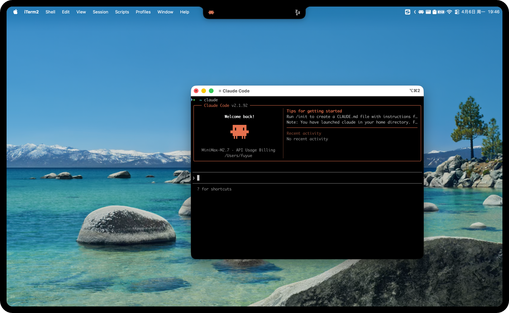
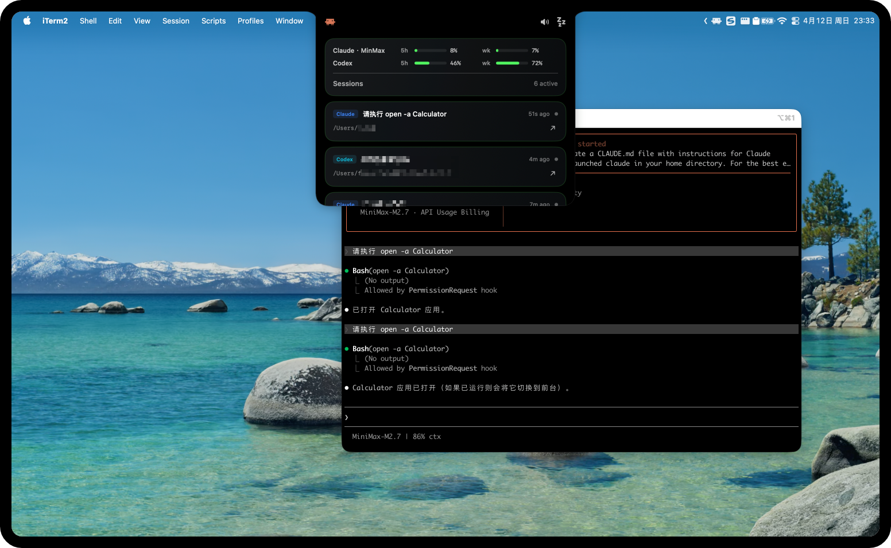
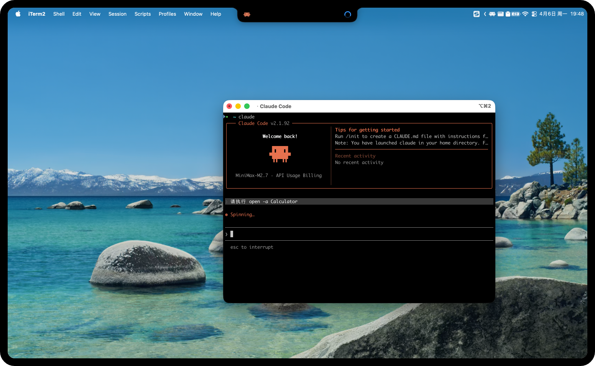
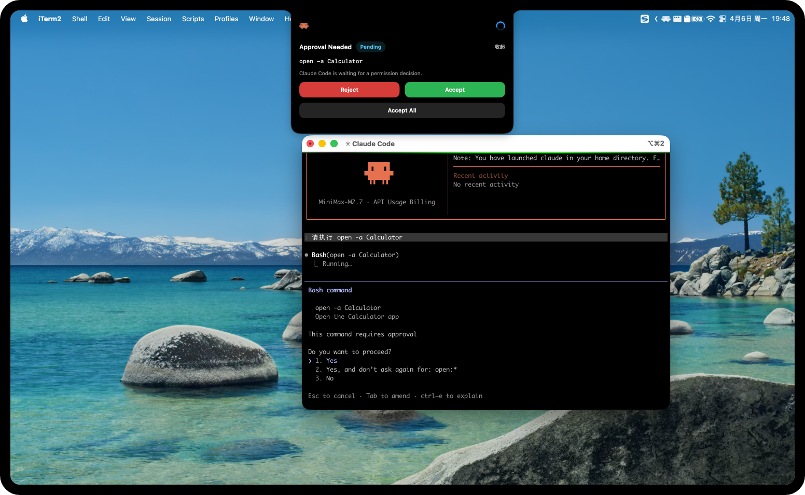
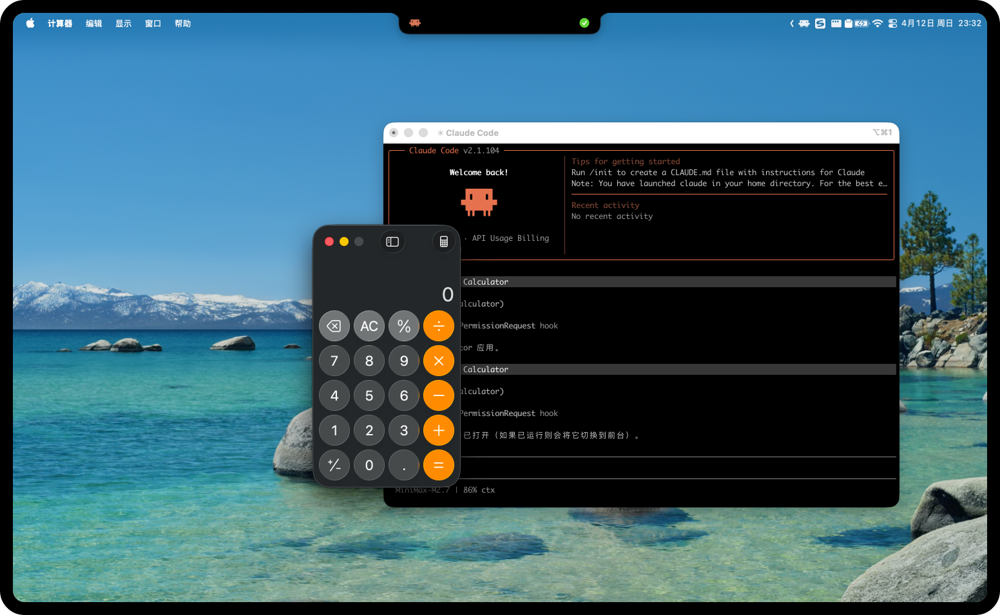

# HermitFlow

<p align="center">
  
</p>

[English](README.md) | [简体中文](README_ZH.md) | [Español](README_ES.md)

HermitFlow es una aplicación de "isla superior" para macOS basada en SwiftUI que muestra la actividad de sesiones CLI locales de `Claude Code`, `Codex` y `OpenCode`, solicitudes de aprobación, prompts de preguntas, ventanas de uso y objetivos de enfoque rápido.

Su objetivo no es reemplazar tu terminal o cliente de escritorio, sino mantener visible el estado más importante de la CLI en la parte superior de la pantalla mientras trabajas.

## Por qué el Nombre

`HermitFlow` proviene de dos partes:

- `Hermit`: el cangrejo ermitaño, que representa a un agente de IA o CLI que se acopla al sistema mientras este se ejecuta.
- `Flow`: que representa el flujo de tareas, el flujo del agente y el flujo de actividad de la CLI.

Juntos, el nombre describe flujos de IA y de tareas que viven dentro del sistema y siguen moviéndose mientras trabajas.

## Características

- Ventana flotante sin bordes centrada en la parte superior de la pantalla y alineada con el área segura y el alojamiento de la cámara.
- Tres modos de visualización: oculto, isla y panel expandido.
- Agrega sesiones locales recientes de `Claude Code`, `Codex` y `OpenCode`.
- Muestra el origen de la sesión, el directorio de trabajo, el estado de ejecución y la hora de la última actualización.
- Detecta solicitudes de aprobación y permite gestionarlas directamente desde la isla o el panel.
- Detecta prompts de preguntas de Claude y OpenCode y admite respuestas integradas en la aplicación.
- La aprobación en línea admite selección y confirmación mediante el teclado.
- Lee instantáneas de uso para `Claude Code`, `Codex` y proveedores externos compatibles de OpenCode.
- Renderiza barras de uso de Claude/Codex/OpenCode en el panel expandido.
- Proporciona objetivos de enfoque de un solo clic para sesiones compatibles de `Claude Code`, `Codex` y `OpenCode`.
- El menú de la barra de estado permite mostrar/ocultar y cambiar el logotipo de la marca del lado izquierdo.
- El menú de la barra de estado permite la resincronización manual de `Resync Claude Hooks`.
- Tarjeta de diagnóstico integrada en el panel para errores de sincronización de hooks de Claude.
- Las aprobaciones de `Codex CLI` se pueden ejecutar a través de la automatización de Accesibilidad de macOS.
- `Claude Code` se integra mediante hooks locales, con aprobaciones resueltas a través de un callback HTTP local.
- `OpenCode` se integra mediante un plugin global gestionado, con aprobaciones y preguntas resueltas a través del listener local de HermitFlow.

## Demostración

### Inactivo



### Panel



### Ejecutando



### Solicitud de Aprobación



### Éxito



### Hacer Pregunta


### Ajustes


## Cómo Funciona

### Codex

Al iniciar, la aplicación consulta archivos locales en `~/.codex` y agrega sesiones recientes de Codex, su estado y posibles objetivos de enfoque. La implementación actual lee de:

- `~/.codex/state_5.sqlite`
- `~/.codex/logs_1.sqlite`
- `~/.codex/sessions/`
- `~/.codex/.codex-global-state.json`
- `~/.codex/log/codex-tui.log`
- `~/.codex/shell_snapshots/`

Si estos archivos no existen, HermitFlow seguirá funcionando, pero el estado de Codex se mostrará como no disponible o inactivo.

HermitFlow también lee el uso de Codex localmente desde los logs de rollout en:

- `~/.codex/sessions/**/rollout-*.jsonl`

La aplicación escanea primero los archivos de rollout más nuevos y extrae la última carga válida de `token_count.rate_limits` local. Si los datos de uso de rollout faltan, están mal formados o no están disponibles, el resto de la aplicación seguirá funcionando y la fila de uso simplemente se omitirá.

### Claude Code

HermitFlow ya está integrado con Claude Code. Al iniciar, realiza los siguientes pasos de configuración:

- Inicia un listener local para eventos de hooks de Claude Code.
- Escribe un script de hook en `~/.hermitflow/claude-hooks/`.
- Sincroniza los archivos de configuración de Claude y registra los hooks requeridos.

En la práctica:

- Los eventos de estado se reportan a través de hooks de comandos locales.
- Las solicitudes de aprobación se envían de vuelta a HermitFlow a través de un hook HTTP local.
- Los prompts de preguntas de Claude se reflejan en HermitFlow a través de hooks HTTP locales.
- La ruta de callback de aprobación específica de HermitFlow es `/permission/hermitflow`.
- La ruta de callback de Elicitación es `/question/hermitflow`.
- La ruta de callback de toma de control de AskUserQuestion es `/ask-user/hermitflow`.
- Las aprobaciones de Claude no requieren permisos de Accesibilidad de macOS.

El manejo de preguntas de Claude admite dos modos:

- `HermitFlow Answer`: intercepta `AskUserQuestion`, permite elegir una opción preestablecida o escribir una respuesta personalizada en HermitFlow, y luego envía la respuesta de vuelta a Claude.
- `Claude Native Answer`: mantiene activo el flujo nativo de `AskUserQuestion` de Claude y muestra un prompt reflejado en HermitFlow para que puedas mantener el contexto mientras respondes en la CLI de Claude o en la extensión de Claude.

Para un recorrido a nivel de código del pipeline de estado actual de Claude, consulta [docs/claude-state-flow.md](docs/claude-state-flow.md).

Si `node` no está disponible en la máquina, la integración de hooks de Claude no funcionará.

HermitFlow también puede leer el uso de Claude localmente desde su propio archivo de caché gestionado:

- `/tmp/hermitflow-rl.json`

Este archivo es opcional y solo local. HermitFlow lo escribe desde su propio hook de Claude y puente `statusLine` cuando las cargas de Claude upstream exponen campos de uso compatibles. Si el archivo no existe, HermitFlow puede recurrir a una consulta de uso de proveedor externo definida en:

- `~/.hermitflow/claude-provider-usage.json`

### OpenCode

HermitFlow también se integra con OpenCode a través de un plugin global gestionado. Al iniciar:

- Inicia el listener local de OpenCode.
- Escribe el plugin gestionado en `~/.config/opencode/plugins/hermitflow.js`.
- Asegura que el paquete del plugin de OpenCode tenga `@opencode-ai/plugin`.

El plugin reporta eventos de sesión, mensaje, herramienta, permiso y pregunta de vuelta a HermitFlow. El listener local de OpenCode expone:

- `GET /health`
- `POST /opencode/event`
- `GET /opencode/state`
- `GET /opencode/approval-decision`
- `GET /opencode/question-decision`

Las aprobaciones de OpenCode aparecen en la misma interfaz de aprobación que Claude y Codex. Las decisiones de aprobación son encoladas por HermitFlow y consultadas por el plugin de OpenCode, por lo que no requieren automatización de Accesibilidad de macOS.

Los prompts de preguntas de OpenCode también se muestran en la interfaz de preguntas de HermitFlow. El plugin gestionado proporciona una herramienta `question` que puede hacer una o más preguntas estructuradas y esperar a que HermitFlow devuelva la respuesta.

Para la visualización del estado, HermitFlow utiliza primero eventos en vivo del plugin y recurre a la base de datos SQLite local de OpenCode cuando los eventos en vivo no están disponibles:

- `~/.local/share/opencode/opencode.db`

El uso de OpenCode se basa en el proveedor. HermitFlow lee el contexto más reciente del proveedor/modelo de OpenCode desde la base de datos local, combina la configuración global y de proyecto de OpenCode, resuelve `provider.<id>.options.baseURL` y `provider.<id>.options.apiKey`, y luego utiliza la configuración de uso de proveedor compartida:

- `~/.hermitflow/claude-provider-usage.json`

## Requisitos

- macOS
- Xcode
- Un entorno local donde ya se haya utilizado `Codex`, `Claude Code` u `OpenCode`.
- Para la integración de Claude Code: un ejecutable `node` en el entorno.
- Para la integración de OpenCode: una instalación de OpenCode con soporte para plugins.
- Para la auto-aprobación de Codex: permiso de Accesibilidad de macOS concedido a HermitFlow.

## Abrir y Ejecutar

1. Abre [HermitFlow.xcodeproj](/Users/fuyue/Documents/HermitFlow/HermitFlow.xcodeproj) en Xcode.
2. Selecciona el esquema `HermitFlow`.
3. Ejecuta la aplicación.

En el primer lanzamiento, la aplicación inmediatamente:

- Inicia el monitoreo de sesiones locales.
- Intenta instalar y sincronizar los hooks de Claude Code.
- Intenta instalar y sincronizar el plugin gestionado de OpenCode.
- Verifica el estado del permiso de Accesibilidad.

Si la inicialización de los hooks de Claude falla, la aplicación seguirá funcionando, pero el estado y las aprobaciones de Claude Code no funcionarán. Los errores relacionados se muestran en la tarjeta `Diagnostic` del panel.

## Uso

- Clic sencillo en la isla: oculto -> isla, o isla -> panel.
- Doble clic en la isla: isla/panel -> oculto.
- Abre el panel para inspeccionar sesiones recientes, solicitudes de aprobación y detalles de la sesión.
- Las tarjetas de aprobación en el panel se pueden gestionar directamente con `Deny`, `Allow Once` y `Always Allow`.
- Las tarjetas de preguntas de Claude y OpenCode pueden aparecer en la isla o el panel cuando una CLI necesite entrada.
- El panel expandido también puede mostrar barras de uso para `Claude`, `Codex` y `OpenCode`.
- Cuando existe una solicitud de aprobación, la isla se expande en una tarjeta de aprobación en línea.
- Cuando existe un prompt de pregunta de Claude o OpenCode, la isla puede expandirse en una tarjeta de pregunta en línea.
- En la tarjeta de aprobación en línea, usa `Izquierda` / `Derecha` para cambiar la acción seleccionada y `Return` para confirmarla.
- Si una aprobación se gestiona directamente en la terminal, HermitFlow colapsa la interfaz de aprobación después de que las fuentes locales observen que la solicitud ha sido resuelta o ha desaparecido.
- La tarjeta `Diagnostic` muestra fallos de sincronización de hooks de Claude.
- Usa `Resync Claude Hooks` desde el panel o el menú de la barra de estado para reintentar la sincronización de hooks.
- Usa el botón de enfoque en una tarjeta de sesión o aprobación para traer al frente el cliente de `Claude Code` / `Codex` / `OpenCode` relacionado.
- Para sesiones de terminal, HermitFlow intentará volver a la ventana correspondiente de `iTerm`, `Warp`, `Terminal`, `WezTerm`, `Ghostty` o `Alacritty`; `iTerm` / `WezTerm` prefieren pistas de sesión locales, mientras que otras terminales usan coincidencia de título de espacio de trabajo según disponibilidad.
- Usa el icono de la barra de estado para mostrar/ocultar la ventana y cambiar el logotipo del lado izquierdo.

### Manejo de Preguntas

HermitFlow admite prompts de preguntas de Claude y OpenCode.

Claude admite dos flujos de trabajo de preguntas, y el modo actual se puede cambiar desde los ajustes rápidos del panel:

- `HermitFlow Answer`: la tarjeta de pregunta es interactiva, por lo que puedes hacer clic en una opción sugerida o escribir otra respuesta y enviarla sin salir de HermitFlow.
- `Claude Native Answer`: HermitFlow refleja el prompt solo para visibilidad; la respuesta debe completarse en la CLI de Claude o en la extensión de Claude.

Las preguntas de OpenCode siempre se manejan a través de la tarjeta de preguntas de HermitFlow. La respuesta se encola localmente y se devuelve al plugin de OpenCode a través del listener.

### Sección de Uso

El panel expandido muestra el uso en la misma pila de tarjetas que la lista de sesiones:

- `Claude`: barras de porcentaje restantes para `5h` y `wk` cuando existe una caché de uso local de Claude, o un proveedor externo de Claude compatible responde con datos de cuota compatibles.
- `Codex`: barras de porcentaje restantes para `5h` y `wk` cuando existen datos de uso de rollout locales.
- `OpenCode · <Proveedor>`: ventanas de cuota del proveedor cuando OpenCode está utilizando un proveedor externo compatible y la API de cuota del proveedor responde con datos compatibles.

La sección de uso prioriza lo local y es opcional:

- Sin archivo de uso: el panel sigue funcionando y las filas de uso se omiten.
- Archivo de uso obsoleto o mal formado: el panel sigue funcionando y la fila del proveedor inválido se omite.
- Proveedor externo compatible detectado con cuota remota válida: la fila/tarjeta de Claude se etiqueta como `Claude · <Proveedor>` y la fila/tarjeta de OpenCode como `OpenCode · <Proveedor>`.
- Si `~/.hermitflow/claude-provider-usage.json` define una consulta de uso basada en comandos de nivel superior, HermitFlow usa ese comando para el uso del proveedor de Claude y OpenCode.
- Si ese comando falla, agota el tiempo de espera o devuelve un porcentaje inválido, la fila de uso relacionada se oculta y HermitFlow no recurre a la solicitud HTTP del proveedor.

La interfaz actual muestra por defecto la cuota restante, y se puede cambiar a cuota utilizada en los Ajustes.

Para Claude, la visibilidad del uso depende de la forma de la carga local, una consulta de uso basada en comandos de nivel superior en `~/.hermitflow/claude-provider-usage.json`, o una respuesta de un proveedor externo compatible. Los campos oficiales de estilo Claude `rate_limits.five_hour` y `rate_limits.seven_day` se renderizan como `5h` y `wk`. Las consultas basadas en comandos también pueden emitir una ventana `day` personalizada; cuando está presente, la interfaz de Claude muestra solo `day` y oculta las etiquetas predeterminadas `5h` / `wk`. Algunos modelos compatibles con Anthropic de terceros solo exponen datos de ventana de contexto u omiten los campos de límite de tasa, en cuyo caso el uso de Claude estará ausente aunque la actividad y las aprobaciones de Claude sigan funcionando.

Para OpenCode, la visibilidad del uso depende del contexto más reciente del proveedor/modelo de OpenCode, la configuración combinada de OpenCode, una `provider.<id>.options.apiKey` resoluble y las mismas definiciones de uso de proveedor en `~/.hermitflow/claude-provider-usage.json`. Si el token se almacena solo a través de un flujo de cuenta de OpenCode y no puede resolverse desde la configuración, la actividad, las aprobaciones y las preguntas de OpenCode seguirán funcionando, pero el uso de OpenCode se omitirá.

### Uso de Proveedores Externos

HermitFlow puede detectar proveedores externos de Claude compatibles leyendo:

- `ANTHROPIC_BASE_URL`
- `ANTHROPIC_MODEL`
- la carga más reciente de `statusLine` gestionada por Claude

Para OpenCode, HermitFlow detecta proveedores externos compatibles desde el contexto más reciente del proveedor/modelo de OpenCode y la configuración combinada de OpenCode.

Las definiciones de uso del proveedor de Claude y OpenCode comparten un archivo:

- `~/.hermitflow/claude-provider-usage.json`

El primer lanzamiento escribe una plantilla predeterminada para:

- `Kimi`
- `Zhipu`
- `ZenMux`
- `MinMax`

Endpoints predeterminados integrados actuales:

- `Kimi`: `https://api.kimi.com/coding/v1/usages`
- `Zhipu`: `https://api.z.ai/api/monitor/usage/quota/limit`
- `ZenMux`: `https://zenmux.ai/api/v1/management/subscription/detail`
- `MinMax`: `https://www.minimaxi.com/v1/api/openplatform/coding_plan/remains`

El archivo de configuración puede definir:

- Una consulta de uso opcional basada en comandos de nivel superior.
- La lista de reglas de coincidencia de proveedores y consultas de uso HTTP.

Cada entrada de proveedor define:

- Cómo se hace la coincidencia del proveedor.
- Qué endpoint de uso llamar.
- Qué nombre de encabezado de autenticación y prefijo usar.
- Qué encabezados/query/body de solicitud enviar.
- Qué `authEnvKey` usar para `Authorization: Bearer <token>`.
- Cómo mapear la respuesta en ventanas de uso `5h` / `wk` o personalizadas.

Para OpenCode, la coincidencia de proveedores también puede usar `providerIDs` además de la URL base y los prefijos del modelo. Los tokens de OpenCode se leen primero de las opciones del proveedor en `opencode.json/jsonc`, incluyendo sustituciones `{env:NAME}` y `{file:path}`.

Las consultas de uso basadas en comandos son útiles cuando la cuota solo está disponible a través de un wrapper CLI local. Cuando el `usageCommand` de nivel superior está presente, HermitFlow omite la detección del proveedor y utiliza solo ese comando para el uso respaldado por el proveedor. Ejemplo:

```json
{
  "usageCommand": {
    "command": "echo '{}' | ~/xxx/hook-cli cc_statusLine | awk '{print $NF}'",
    "window": "day",
    "valueKind": "usedPercentage",
    "displayLabel": "day",
    "timeoutSeconds": 5
  },
  "providers": []
}
```

`valueKind` actualmente admite:

- `usedPercentage`: la salida del comando ya es la relación/porcentaje utilizado.
- `remainingPercentage`: la salida del comando es la relación/porcentaje restante, y HermitFlow lo convierte internamente en porcentaje utilizado.

Para Claude, `authEnvKey` admite dos formas:

- Un nombre de variable de entorno de `settings.json.env` de Claude.
- Un valor de token directo como `sk-...`.

Para OpenCode, `authEnvKey` puede ser `apiKey`, un token resuelto de la configuración de OpenCode o un nombre de variable de entorno. Los valores predeterminados compartidos de Claude como `ANTHROPIC_AUTH_TOKEN` se tratan como "usar la clave de API del proveedor de OpenCode" en la ruta de OpenCode.

Si `~/.hermitflow/claude-provider-usage.json` ya existe, HermitFlow no lo sobrescribe automáticamente. Actualiza el archivo local manualmente para adoptar los endpoints predeterminados cambiados.

Para proveedores con formas de respuesta no uniformes, HermitFlow también incluye analizadores específicos del proveedor:

- `ZenMux`: lee `data.quota_5_hour` y `data.quota_7_day`.
- `MinMax`: lee `model_remains[]`, prefiere el modelo actual de Claude y luego recurre a `MiniMax-M*`.
- `Kimi`: lee `limits[].detail` y `usage` de nivel superior.
- `Zhipu`: lee `data.limits[]` con `type == TOKENS_LIMIT`.

Esto significa que algunos proveedores pueden funcionar incluso cuando un mapeo simple de ruta JSON estática no sería suficiente.

## Permisos y Configuración

### Accesibilidad

Solo la auto-aprobación de `Codex CLI` depende del permiso de Accesibilidad de macOS. Si falta el permiso, HermitFlow muestra un aviso en el panel y proporciona un acceso directo para abrir los Ajustes del Sistema.

### Sincronización de Ajustes de Claude

Para integrar Claude Code, HermitFlow actualiza la sección `hooks` en `~/.claude/settings.json` por defecto y escribe su propio script de hook local. Si ya tienes hooks personalizados de Claude, HermitFlow intenta actualizar solo sus propias entradas relacionadas en lugar de sobrescribir todo el archivo.

Objetivos de sincronización compatibles:

- Ruta predeterminada: `~/.claude/settings.json`
- Archivo de rutas adicionales: `~/.hermitflow/claude-settings-paths.json`
- Variable de entorno adicional: `HERMITFLOW_CLAUDE_SETTINGS_PATHS`

`~/.hermitflow/claude-settings-paths.json` admite dos formatos:

- Matriz JSON, por ejemplo `["~/custom-claude/settings.json", "/opt/company/claude/settings.json"]`
- Forma de objeto, por ejemplo `{"paths":["~/custom-claude/settings.json","/opt/company/claude/settings.json"]}`

`HERMITFLOW_CLAUDE_SETTINGS_PATHS` admite múltiples rutas separadas por saltos de línea o puntos y coma.

La ruta predeterminada `~/.claude/settings.json` siempre permanece como parte de la lista de sincronización.

Estas rutas de ajustes también se utilizan para inferir las raíces de datos locales de Claude para el descubrimiento de sesiones. Por ejemplo, después de configurar `~/custom-claude/settings.json`, HermitFlow también lee `~/custom-claude/sessions`, `~/custom-claude/projects` y `~/custom-claude/history.jsonl`. Si la configuración de la ruta adicional no se puede analizar, el descubrimiento de sesiones vuelve a la raíz predeterminada `~/.claude`.

Estos casos borde se manejan de forma segura:

- El `settings.json` personalizado no existe: se creará.
- El `settings.json` personalizado está vacío: se tratará como un objeto vacío `{}` y luego se escribirá.
- `claude-settings-paths.json` contiene una coma final común: se analiza con compatibilidad relajada.

### Sincronización de Plugin de OpenCode

Para integrar OpenCode, HermitFlow escribe solo su archivo de plugin global gestionado:

- `~/.config/opencode/plugins/hermitflow.js`

No modifica los directorios `.opencode/` a nivel de proyecto. El archivo del plugin gestionado contiene un marcador y puede ser regenerado la forma segura por HermitFlow. Los plugins personalizados locales de OpenCode deben usar un nombre de archivo diferente.

## Empaquetado

El repositorio incluye un script de empaquetado local:

```bash
./scripts/package.sh
```

Por defecto, construye un paquete `Release` para la arquitectura de máquina actual y genera `HermitFlow-<arch>.app` y `HermitFlow-<arch>.pkg`.

Por ejemplo, en Apple Silicon genera:

- `/Users/fuyue/Documents/HermitFlow/dist/HermitFlow-arm64.app`
- `/Users/fuyue/Documents/HermitFlow/dist/HermitFlow-arm64.pkg`

Para construir un instalador Intel (`x86_64`) desde Apple Silicon:

```bash
./scripts/package.sh Release intel
```

Esto genera:

- `/Users/fuyue/Documents/HermitFlow/dist/HermitFlow-intel.app`
- `/Users/fuyue/Documents/HermitFlow/dist/HermitFlow-intel.pkg`

Para construir un paquete `Debug`:

```bash
./scripts/package.sh Debug
```

Para construir un `dmg` a partir de una aplicación ya empaquetada:

```bash
./scripts/package-dmg.sh
```

Para construir un `dmg` Intel (`x86_64`):

```bash
./scripts/package-dmg.sh Release intel
```

## Estructura del Proyecto

- `HermitFlow.xcodeproj`: proyecto de Xcode.
- `DynamicCLIIsland/`: fuente principal de la aplicación.
- `DynamicCLIIsland/App/`: entorno de la app y composición de bootstrap.
- `DynamicCLIIsland/Core/`: modelos compartidos, reducers, protocolos, utilidades y eventos.
- `DynamicCLIIsland/State/`: almacenes de app, tiempo de ejecución y presentación.
- `DynamicCLIIsland/Views/`: UI de SwiftUI.
- `DynamicCLIIsland/Views/Approval/`: vistas específicas de aprobación.
- `DynamicCLIIsland/Views/Diagnostics/`: vistas específicas de diagnósticos.
- `DynamicCLIIsland/Views/Usage/`: tarjetas y resúmenes de uso local.
- `DynamicCLIIsland/Stores/`: agregación de estado y gestión de estado de la UI.
- `DynamicCLIIsland/Sources/`: fuentes locales de Claude/Codex/OpenCode e integración de hooks.
- `DynamicCLIIsland/Services/`: enfoque, ejecución de aprobaciones, diagnósticos, uso e integración del sistema.
- `DynamicCLIIsland/Coordinators/`: coordinadores extraídos de ventana, barra de menú y monitoreo.
- `DynamicCLIIsland/Legacy/`: adaptadores de compatibilidad mantenidos durante la refactorización.
- `DynamicCLIIsland/Resources/`: activos de imagen empaquetados y archivo de licencia de recursos.
- `scripts/package.sh`: script de empaquetado local.
- `scripts/package-dmg.sh`: script de empaquetado DMG local.
- `dist/`: directorio de salida del empaquetado.

## Limitaciones Conocidas

- HermitFlow depende de archivos y procesos locales de Claude/Codex/OpenCode y no proporciona sincronización remota.
- El uso se basa en caché local o consultas al proveedor y puede estar ausente temporalmente incluso cuando Claude/Codex/OpenCode esté instalado.
- El uso de Claude depende de la forma de la carga local de Claude; algunos proveedores compatibles con Anthropic de terceros no exponen ventanas de límite de tasa `5h` / `7d`.
- La integración de Claude Code depende del soporte de hooks locales y de `node`.
- La integración de OpenCode depende del soporte de plugins de OpenCode y de la entrega de eventos de plugins locales.
- El uso de OpenCode depende de una clave de API de proveedor resoluble en la configuración de OpenCode; los tokens almacenados solo en el estado de cuenta de OpenCode pueden no ser visibles para HermitFlow.
- La auto-aprobación de Codex depende del permiso de Accesibilidad y del control de primer plano de la terminal.
- Si otra máquina ya tiene Node instalado pero HermitFlow sigue reportando `Node.js is unavailable for the managed Claude hook script`, la causa habitual es que las aplicaciones iniciadas desde Finder / LaunchServices no heredan las entradas `PATH` del shell añadidas por `nvm`, `fnm`, `asdf`, `Volta` o `mise`. Las versiones más recientes ahora sondean esas ubicaciones de instalación comunes y recurren a una búsqueda de shell de inicio de sesión; en versiones antiguas, expone `node` desde una ruta estable como `/opt/homebrew/bin/node`, `/usr/local/bin/node` o `~/.volta/bin/node`, y luego ejecuta `Resync Claude Hooks` una vez.
- Si una sesión de CLI ya ha finalizado o su ventana ha desaparecido, es posible que algunos objetivos de enfoque ya no funcionen.
- Si un archivo de ajustes de Claude objetivo no es un objeto JSON de nivel superior válido, HermitFlow no lo sobrescribirá.

## Licencia

El código fuente está licenciado bajo la [Licencia MIT](LICENSE).

**Los activos de imágenes y arte en [DynamicCLIIsland/Resources](/Users/fuyue/Documents/HermitFlow/DynamicCLIIsland/Resources) NO están cubiertos por la licencia MIT.** Los derechos permanecen con sus respectivos titulares de derechos de autor. Consulta [DynamicCLIIsland/Resources/LICENSE](/Users/fuyue/Documents/HermitFlow/DynamicCLIIsland/Resources/LICENSE) para más detalles.

- Los activos visuales y de personajes relacionados con **Clawd** y **Claude Code** pertenecen a [Anthropic](https://www.anthropic.com).
- Los activos visuales y de personajes relacionados con **Codex** y **OpenAI** pertenecen a [OpenAI](https://www.openai.com).
- Los activos visuales y de personajes relacionados con **ZenMux** pertenecen a [Zenmux](https://www.zenmux.ai).
- Este proyecto es un proyecto fan no oficial y no está afiliado, respaldado ni patrocinado por las entidades anteriores.
- El copyright de las contribuciones de terceros permanece con sus respectivos autores.
