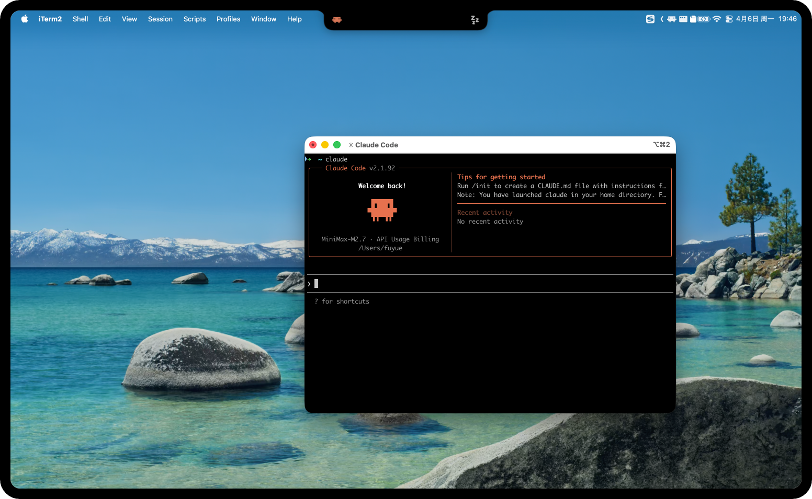
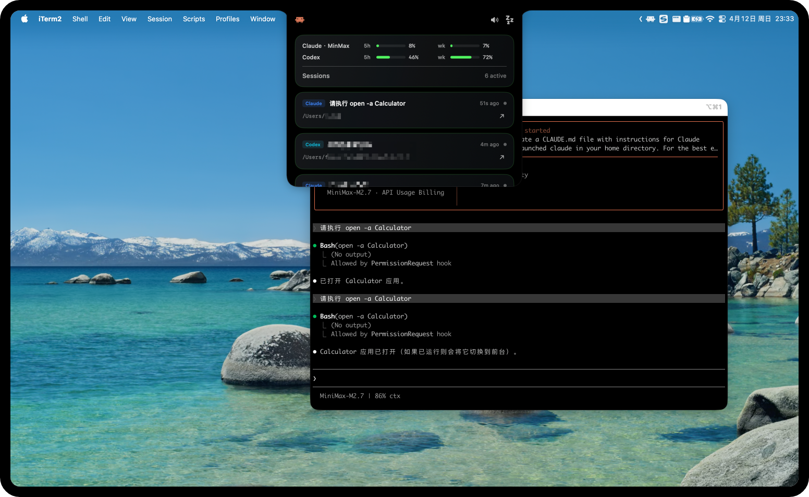
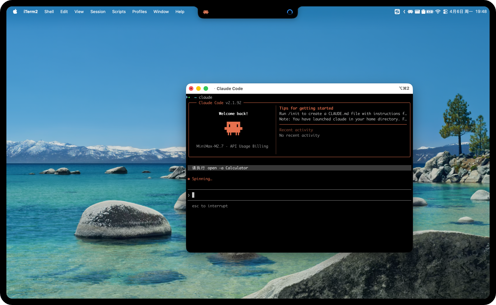
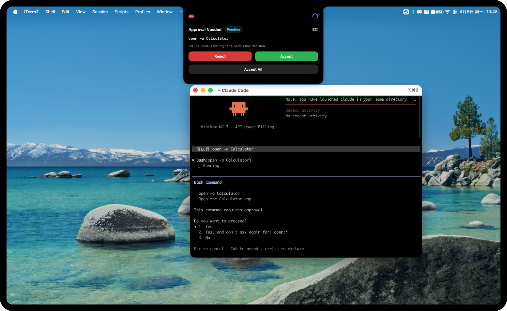
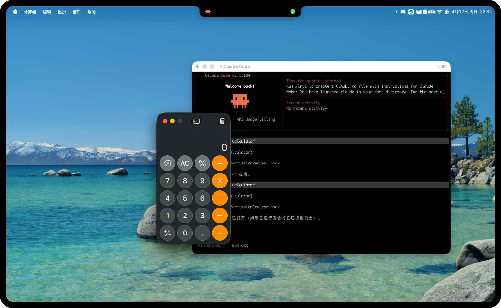

# HermitFlow

[English](README.md) | [简体中文](README_ZH.md)

HermitFlow is a SwiftUI-based macOS top island app that surfaces local `Claude Code`, `Codex`, and other CLI session activity, approval requests, and quick focus targets.

Its goal is not to replace your terminal or desktop client, but to keep the most important CLI state visible at the top of the screen while you work.

## Why The Name

`HermitFlow` comes from two parts:

- `Hermit`: the hermit crab, representing an AI or CLI agent that attaches itself to the system while it is running
- `Flow`: representing task flow, agent flow, and the CLI activity stream

Together, the name describes AI and task flows that live inside the system and keep moving while you work.

## Features

- Borderless floating window centered at the top of the screen and aligned with the safe area and camera housing
- Three display modes: hidden, island, and expanded panel
- Aggregates recent local sessions from both `Claude Code` and `Codex`
- Shows session origin, working directory, runtime status, and last update time
- Detects approval requests and lets you handle them directly from the island or panel
- Inline approval supports keyboard selection and confirmation
- Reads local-first usage snapshots for both `Claude Code` and `Codex`
- Renders Claude/Codex usage bars in the expanded panel without requiring network access
- Provides one-click focus targets for supported `Claude Code` and `Codex` sessions
- Status bar menu supports show/hide and switching the left-side brand logo
- Status bar menu supports manual `Resync Claude Hooks`
- Built-in diagnostic card in the panel for Claude hook sync errors
- `Codex CLI` approvals can be executed through macOS Accessibility automation
- `Claude Code` is integrated through local hooks, with approvals resolved through a local HTTP callback

## Showcase

### Idle



### Panel



### Running



### Approval Request



### Approval Success



## How It Works

### Codex

On launch, the app polls local files under `~/.codex` and aggregates recent Codex sessions, their state, and possible focus targets. The current implementation reads from:

- `~/.codex/state_5.sqlite`
- `~/.codex/logs_1.sqlite`
- `~/.codex/sessions/`
- `~/.codex/.codex-global-state.json`
- `~/.codex/log/codex-tui.log`
- `~/.codex/shell_snapshots/`

If these files are missing, HermitFlow still runs, but Codex state will be shown as unavailable or idle.

HermitFlow also reads Codex usage locally from rollout logs under:

- `~/.codex/sessions/**/rollout-*.jsonl`

The app scans the newest rollout files first and extracts the latest valid local `token_count.rate_limits` payload. If rollout usage data is missing, malformed, or unavailable, the rest of the app continues to work and the usage row is simply omitted.

### Claude Code

HermitFlow is already integrated with Claude Code. On launch, it performs the following setup steps:

- Starts a local listener for Claude Code hook events
- Writes a hook script under `~/.hermitflow/claude-hooks/`
- Synchronizes Claude settings files and registers the required hooks

In practice:

- State events are reported through local command hooks
- Approval requests are sent back to HermitFlow through a local HTTP hook
- The HermitFlow-specific approval callback path is `/permission/hermitflow`
- Claude approvals do not require macOS Accessibility permissions

For a code-level walkthrough of the current Claude state pipeline, see [docs/claude-state-flow.md](docs/claude-state-flow.md).

If `node` is not available on the machine, Claude hook integration will not work.

HermitFlow can also read Claude usage locally from its own managed cache file:

- `/tmp/hermitflow-rl.json`

This file is optional and local-only. HermitFlow writes it from its own Claude hook and `statusLine` bridge when upstream Claude payloads expose compatible usage fields. If the file does not exist, HermitFlow can also fall back to a third-party provider usage query defined in:

- `~/.hermitflow/claude-provider-usage.json`

## Requirements

- macOS
- Xcode
- A local environment where `Codex` or `Claude Code` has already been used
- For Claude Code integration: an executable `node` in the environment
- For Codex auto-approval: macOS Accessibility permission granted to HermitFlow

## Open And Run

1. Open [HermitFlow.xcodeproj](/Users/fuyue/Documents/HermitFlow/HermitFlow.xcodeproj) in Xcode
2. Select the `HermitFlow` scheme
3. Run the app

On first launch, the app immediately:

- starts local session monitoring
- attempts to install and sync Claude Code hooks
- checks Accessibility permission state

If Claude hook initialization fails, the app still runs, but Claude Code status and approvals will not work. Related errors are shown in the panel's `Diagnostic` card.

## Usage

- Single-click the island: hidden -> island, or island -> panel
- Double-click the island: island/panel -> hidden
- Open the panel to inspect recent sessions, approval requests, and session details
- Approval cards in the panel can be handled directly with `Deny`, `Allow Once`, and `Always Allow`
- The expanded panel can also show local usage bars for `Claude` and `Codex`
- When an approval request exists, the island expands into an inline approval card
- In the inline approval card, use `Left` / `Right` to switch the selected action and `Return` to confirm it
- If an approval is handled directly in the terminal, HermitFlow collapses the approval UI after the local sources observe that the request has been resolved or has disappeared
- The `Diagnostic` card shows Claude hook sync failures
- Use `Resync Claude Hooks` from either the panel or the status bar menu to retry hook synchronization
- Use the focus button on a session or approval card to bring the related `Claude Code` / `Codex` client forward
- For `Claude Code` terminal sessions, HermitFlow can also try to route to the matching `iTerm` tab/session or `Warp` window when local session hints are available
- Use the status bar icon to show/hide the window and switch the left-side logo

### Usage Section

The expanded panel shows usage in the same card stack as the session list:

- `Claude`: `5h` and `wk` remaining percentage bars when a local Claude usage cache exists, or a supported third-party Claude provider responds with compatible quota data
- `Codex`: `5h` and `wk` remaining percentage bars when local rollout usage data exists

The usage section is local-first and optional:

- no usage file: the panel still works and the usage rows are omitted
- stale or malformed usage file: the panel still works and the invalid provider row is omitted
- supported third-party provider detected with valid remote quota: the Claude row/card is labeled as `Claude · <Provider>`
- if `~/.hermitflow/claude-provider-usage.json` defines a top-level command-based usage query, HermitFlow uses only that command for Claude usage
- if that command fails, times out, or returns an invalid percentage, Claude usage is hidden and HermitFlow does not fall back to the provider HTTP request

The current UI defaults to showing remaining quota, and can be switched to used quota in Settings.

For Claude, usage visibility depends on either the local payload shape, a top-level command-based usage query in `~/.hermitflow/claude-provider-usage.json`, or a supported third-party provider response. Official Claude-style `rate_limits.five_hour` and `rate_limits.seven_day` fields are rendered as `5h` and `wk`. Command-based queries can also emit a custom `day` window; when present, the Claude UI shows only `day` and hides the default `5h` / `wk` labels. Some third-party Anthropic-compatible models expose only context-window data or omit rate-limit fields entirely, in which case Claude usage will be absent even though Claude activity and approvals still work.

### Third-Party Claude Providers

HermitFlow can detect supported third-party Claude providers by reading:

- `ANTHROPIC_BASE_URL`
- `ANTHROPIC_MODEL`
- the latest managed Claude `statusLine` payload

Provider usage definitions live in:

- `~/.hermitflow/claude-provider-usage.json`

The first launch writes a default template for:

- `Kimi`
- `Zhipu`
- `ZenMux`
- `MinMax`

Current built-in default endpoints:

- `Kimi`: `https://api.kimi.com/coding/v1/usages`
- `Zhipu`: `https://api.z.ai/api/monitor/usage/quota/limit`
- `ZenMux`: `https://zenmux.ai/api/v1/management/subscription/detail`
- `MinMax`: `https://www.minimaxi.com/v1/api/openplatform/coding_plan/remains`

The config file can define:

- one optional top-level command-based usage query
- the list of provider match rules and HTTP usage queries

Each provider entry defines:

- how the provider is matched
- which usage endpoint to call
- which auth header name and prefix to use
- what request headers/query/body to send
- which `authEnvKey` to use for `Authorization: Bearer <token>`
- how to map the response into Claude `5h` / `wk` windows

Command-based usage queries are useful when Claude quota is only available through a local CLI wrapper. When the top-level `usageCommand` is present, HermitFlow skips provider detection and uses only that command. Example:

```json
{
  "usageCommand": {
    "command": "echo '{}' | ~/xxx/hook-cli cc_statusLine | awk '{print $NF}'",
    "window": "day",
    "valueKind": "usedPercentage",
    "displayLabel": "day",
    "timeoutSeconds": 5
  },
  "providers": []
}
```

`valueKind` currently supports:

- `usedPercentage`: command output is already the used ratio/percentage
- `remainingPercentage`: command output is the remaining ratio/percentage, and HermitFlow converts it to used percentage internally

`authEnvKey` supports two forms:

- an environment variable name from Claude `settings.json.env`
- a direct token value such as `sk-...`

If `~/.hermitflow/claude-provider-usage.json` already exists, HermitFlow does not overwrite it automatically. Update the local file manually to pick up changed default endpoints.

For providers with non-uniform response shapes, HermitFlow also includes provider-specific parsers:

- `ZenMux`: reads `data.quota_5_hour` and `data.quota_7_day`
- `MinMax`: reads `model_remains[]`, prefers the current Claude model, then falls back to `MiniMax-M*`
- `Kimi`: reads `limits[].detail` and top-level `usage`
- `Zhipu`: reads `data.limits[]` with `type == TOKENS_LIMIT`

This means some providers can work even when a simple static JSON-path mapping would not be sufficient.

## Permissions And Configuration

### Accessibility

Only `Codex CLI` auto-approval depends on macOS Accessibility permission. If permission is missing, HermitFlow shows a prompt in the panel and provides a shortcut to open System Settings.

### Claude Settings Sync

To integrate Claude Code, HermitFlow updates the `hooks` section in `~/.claude/settings.json` by default and writes its own local hook script. If you already have custom Claude hooks, HermitFlow tries to update only its own related entries instead of overwriting the whole file.

Supported sync targets:

- Default path: `~/.claude/settings.json`
- Additional path file: `~/.hermitflow/claude-settings-paths.json`
- Additional environment variable: `HERMITFLOW_CLAUDE_SETTINGS_PATHS`

`~/.hermitflow/claude-settings-paths.json` supports two formats:

- JSON array, for example `["~/custom-claude/settings.json", "/opt/company/claude/settings.json"]`
- Object form, for example `{"paths":["~/custom-claude/settings.json","/opt/company/claude/settings.json"]}`

`HERMITFLOW_CLAUDE_SETTINGS_PATHS` supports multiple paths separated by newlines or semicolons.

The default path `~/.claude/settings.json` always remains part of the sync list.

These edge cases are handled safely:

- custom `settings.json` does not exist: it will be created
- custom `settings.json` is empty: it will be treated as an empty object `{}` and then written
- `claude-settings-paths.json` contains a common trailing comma: it is parsed with relaxed compatibility

## Packaging

The repository includes a local packaging script:

```bash
./scripts/package.sh
```

By default it builds a `Release` package for the current machine architecture and outputs `HermitFlow-<arch>.app` and `HermitFlow-<arch>.pkg`.

For example, on Apple Silicon it outputs:

- `/Users/fuyue/Documents/HermitFlow/dist/HermitFlow-arm64.app`
- `/Users/fuyue/Documents/HermitFlow/dist/HermitFlow-arm64.pkg`

To build an Intel (`x86_64`) installer from Apple Silicon:

```bash
./scripts/package.sh Release intel
```

This outputs:

- `/Users/fuyue/Documents/HermitFlow/dist/HermitFlow-intel.app`
- `/Users/fuyue/Documents/HermitFlow/dist/HermitFlow-intel.pkg`

To build a `Debug` package:

```bash
./scripts/package.sh Debug
```

To build a `dmg` from an existing packaged app:

```bash
./scripts/package-dmg.sh
```

To build an Intel (`x86_64`) `dmg`:

```bash
./scripts/package-dmg.sh Release intel
```

## Project Structure

- `HermitFlow.xcodeproj`: Xcode project
- `DynamicCLIIsland/`: main application source
- `DynamicCLIIsland/App/`: app environment and bootstrap composition
- `DynamicCLIIsland/Core/`: shared models, reducers, protocols, utilities, and events
- `DynamicCLIIsland/State/`: app, runtime, and presentation stores
- `DynamicCLIIsland/Views/`: SwiftUI UI
- `DynamicCLIIsland/Views/Approval/`: approval-specific views
- `DynamicCLIIsland/Views/Diagnostics/`: diagnostics-specific views
- `DynamicCLIIsland/Views/Usage/`: local usage cards and summaries
- `DynamicCLIIsland/Stores/`: state aggregation and UI state management
- `DynamicCLIIsland/Sources/`: local Claude/Codex sources and hook integration
- `DynamicCLIIsland/Services/`: focus, approval execution, diagnostics, usage, and system integration
- `DynamicCLIIsland/Coordinators/`: extracted window, menu bar, and monitoring coordinators
- `DynamicCLIIsland/Legacy/`: compatibility adapters kept during the refactor
- `DynamicCLIIsland/Resources/`: bundled image assets and resource licensing file
- `scripts/package.sh`: local packaging script
- `scripts/package-dmg.sh`: local DMG packaging script
- `dist/`: packaging output directory

## Known Limits

- HermitFlow depends on local Claude/Codex files and processes and does not provide remote sync
- Usage is local-cache based and may be temporarily absent even when Claude/Codex is installed
- Claude usage depends on the local Claude payload shape; some third-party Anthropic-compatible providers do not expose `5h` / `7d` rate-limit windows
- Claude Code integration depends on local hook support and `node`
- Codex auto-approval depends on Accessibility permission and terminal foreground control
- If another machine already has Node installed but HermitFlow still reports `Node.js is unavailable for the managed Claude hook script`, the usual cause is that apps launched from Finder / LaunchServices do not inherit the shell `PATH` entries added by `nvm`, `fnm`, `asdf`, `Volta`, or `mise`. Newer builds now probe those common install locations and fall back to a login shell lookup; on older builds, expose `node` from a stable path such as `/opt/homebrew/bin/node`, `/usr/local/bin/node`, or `~/.volta/bin/node`, then run `Resync Claude Hooks` once.
- If a CLI session has already exited or its window is gone, some focus targets may no longer work
- If a target Claude settings file is not a valid top-level JSON object, HermitFlow will not overwrite it

## License

Source code is licensed under the [MIT License](LICENSE).

**Image and artwork assets in [DynamicCLIIsland/Resources](/Users/fuyue/Documents/HermitFlow/DynamicCLIIsland/Resources) are NOT covered by the MIT license.** Rights remain with their respective copyright holders. See [DynamicCLIIsland/Resources/LICENSE](/Users/fuyue/Documents/HermitFlow/DynamicCLIIsland/Resources/LICENSE) for details.

- **Clawd** and **Claude Code** related character and visual assets belong to [Anthropic](https://www.anthropic.com).
- **Codex** and **OpenAI** related character and visual assets belong to [OpenAI](https://www.openai.com).
- **ZenMux** related character and visual assets belong to [Zenmux](https://www.zenmux.ai).
- This project is an unofficial fan project and is not affiliated with, endorsed by, or sponsored by the entities above.
- Copyright for third-party contributions remains with their respective authors.
